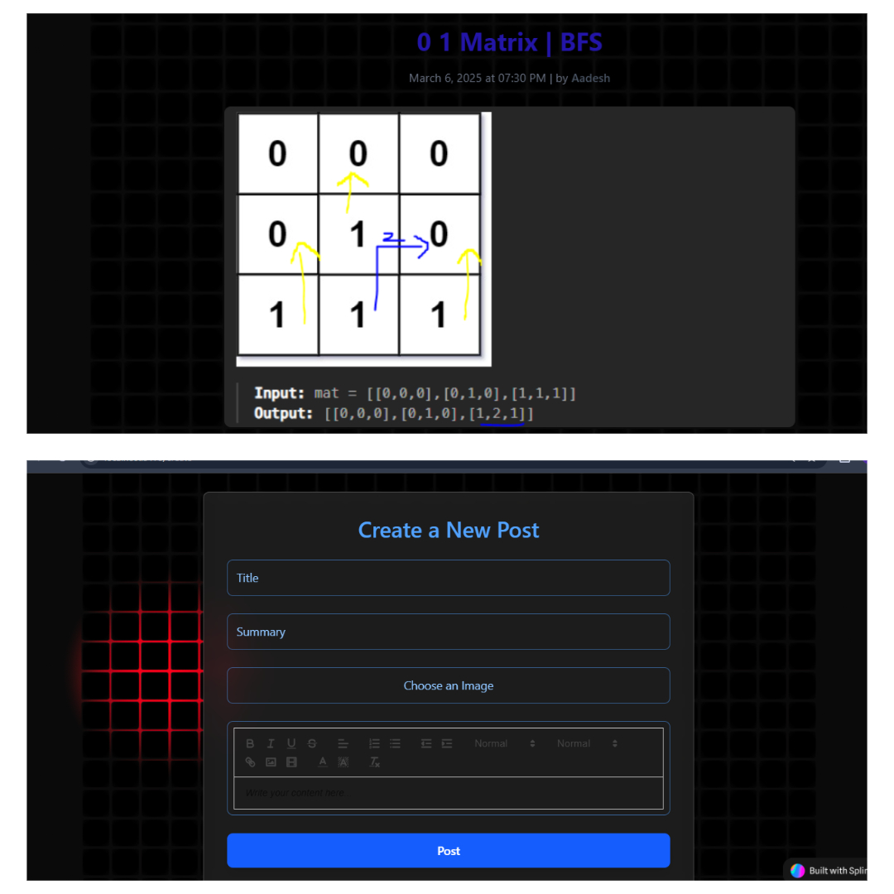

# 📝 Code Journal

**Code Journal** is a full-stack blog application that allows users to create, edit, and manage blog posts. It features a rich text editor, authentication, and a sleek user interface built with modern web technologies.

---

## 🚀 Features

### ✨ Frontend
- 🖊 **Rich Text Editor** – Create beautiful blog posts using **Quill.js**.
- 🎨 **Modern UI** – Styled with **Tailwind CSS** for a clean, responsive design.
- 🔄 **Routing** – Handled with **React Router DOM** for seamless navigation.
- 📜 **Interactive 3D Elements** – Integrated with **Spline 3D** for a visually engaging experience.

### ⚙️ Backend
- 🔐 **Authentication** – Secure login/signup using **JWT & bcrypt**.
- 🛢 **Database** – Uses **MongoDB & Mongoose** to store user data and posts.
- 📂 **File Uploads** – Upload images using **Multer**.
- 🌍 **CORS Enabled** – Allows smooth frontend-backend communication.

---

## 🛠 Tech Stack

### 📌 Frontend
- **React.js** – UI Library
- **React Router DOM** – Page Navigation
- **Quill.js** – Rich Text Editor
- **Tailwind CSS** – Styling
- **Spline 3D** – Interactive 3D components

### 🔧 Backend
- **Node.js** – JavaScript runtime
- **Express.js** – Backend framework
- **MongoDB & Mongoose** – Database & ORM
- **JWT** – Authentication
- **Multer** – File uploads
- **Dotenv** – Environment variable management

---

## 📦 Installation

### 🔹 Clone the Repository
```sh
git clone https://github.com/your-username/code-journal.git
cd code-journal
```

---

## 📂 Project Structure
```bash
/code-journal
 ├── frontend/       # React.js Frontend
 │   ├── src/
 │   │   ├── components/  # UI Components
 │   │   ├── pages/       # Page Components
 │   │   ├── App.js       # Main App Component
 │   │   ├── main.jsx     # Entry Point
 │   ├── public/
 │   ├── package.json
 │   ├── tailwind.config.js
 │   └── vite.config.js
 │
 ├── backend/        # Express.js Backend
 │   ├── models/     # Mongoose Schemas
 │   ├── routes/     # API Routes
 │   ├── middleware/ # Auth & Security
 │   ├── server.js   # Main Server File
 │   ├── .env        # Environment Variables
 │   ├── package.json
 │   └── README.md
 │
 ├── .gitignore
 ├── README.md
 ├── LICENSE
```

---

## 🔧 Installation & Setup

### 1️⃣ Clone the Repository
```bash
git clone https://github.com/yourusername/code-journal.git
cd code-journal
```

### 2️⃣ Install Dependencies
#### Frontend
```bash
cd frontend
npm install
```
#### Backend
```bash
cd backend
npm install
```

### 3️⃣ Set Up Environment Variables
Create a `.env` file in the `backend/` directory and add:
```ini
PORT=5000
MONGO_URI=your_mongodb_connection_string
JWT_SECRET=your_jwt_secret_key
```

### 4️⃣ Run the Application
#### Start Backend Server
```bash
cd backend
nodemon index.js
```
#### Start Frontend
```bash
cd frontend
npm run dev
```
---
# ScreenShots

.jpg)


